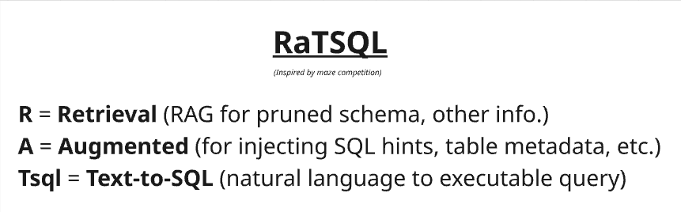
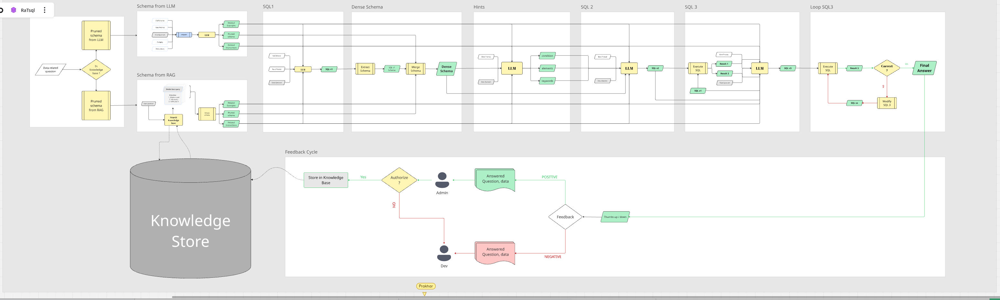

# Flow dig : [Click for high quality](https://miro.com/app/board/uXjVJZTBDcc=/?share_link_id=245310762751)

# SETUP : 

1. Create env
    
    ```bash
    conda create -n ratsql python=3.12
    conda activate ratsql
    ```
    ```bash
    pip install -r requirements.txt
    ```

2. Prepare Data
    
    ```bash 
    python RaTsql/src/modules/prepare_data/prepare_metadata.py
    ```

3. Store data to RAG
    
    ```bash
    python RaTsql/src/modules/vector_store/populate_vectore_space.py
    ```

4. Run graph
    ```bash
    python RaTsql/src/run_graphs.py
    ```